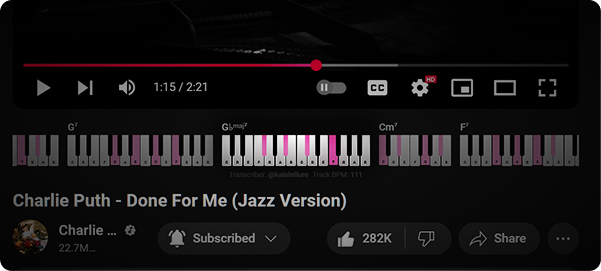

<i>
open-chord lets your favorite song's chords under the player.
</i>

# Features
- **Zero Overhead**: Install Extension &rarr; Get song's chord progression right at the music video page no configuration needed.
- **Made by you for you**: Easily add, edit or fix transcriptions.

# Technical Summary
The current tech-stack is the following:

- **Extension**: The extension's content injected UI interface uses Preact for a lightweight reactive design, styling is done with TailwindCSS, all being bundled using Vite to an IIFE `content.js` file.
- **Storage**: Initially transcriptions files are being stored using Github's Pages serving pre-generated JSON files. As it's grows and start requiring more infrastructure we do plan to add a CDN strategy or a database solution.

# Helping With Transcriptions
- WIP...