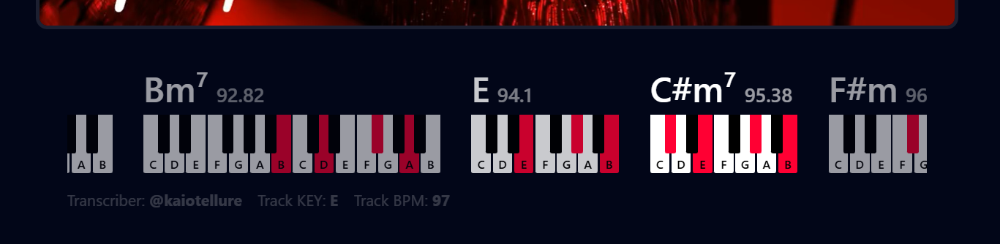

###### Get Extension

###### Features
- **Zero Overhead**: Just install, no initial configuration required.
- **Community Driven**: Easily add, edit or fix transcriptions.

###### Technical Summary

- **Extension**: The extension's content injected UI interface uses Preact for a lightweight reactive design, styling is done with TailwindCSS, all being bundled using Vite to an IIFE `content.js` file.
- **Storage**: Initially transcriptions files are being stored using Github's Pages serving pre-generated JSON files. As it grows and starts requiring a more robust infrastructure we do plan to add a CDN strategy or a database solution.
